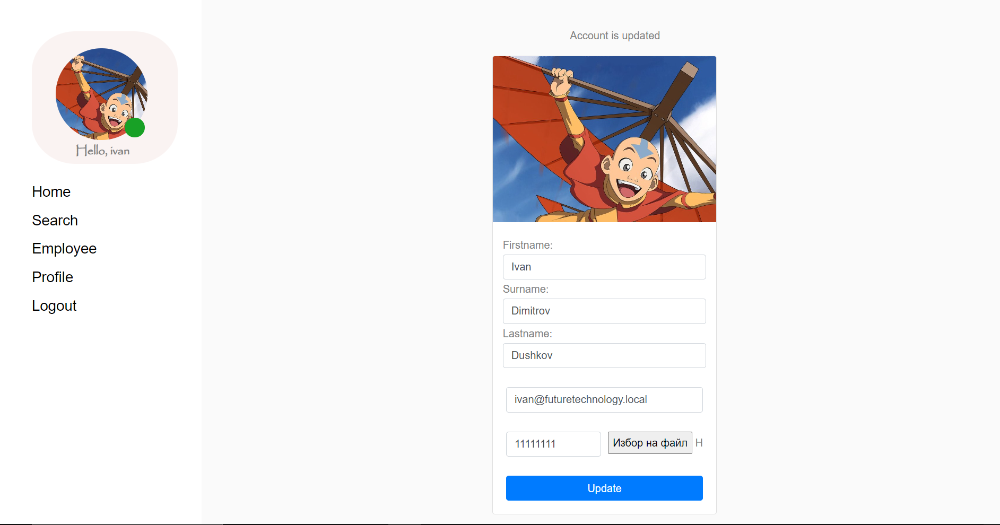

# 🏢 **Employee Register**
The Employee Register is a Django-based application designed to manage and track employee information. This application allows users to create a company profile, add employees, search, edit, and delete employee records, and perform account-related operations such as updating details, changing passwords, and deleting accounts.

## 📋 **Features**
Create a User Account: Sign up to manage your company's employee database.
Company Information: Add your company name and details after registering.
Employee Management: Easily add, search, edit, and delete employee records.
Account Management: Update your user profile, change your password, and manage your account settings.
Password Recovery: Reset your password via email with proper email configuration

### 🖼️ Screenshots
1. Create User Account
Easily sign up to access the employee management dashboard.

2. Enter Your Company Name
After registering, input your company's information to get started.

3. Add Employee
Add employees to your company's database with ease.

4. Search, Edit, or Delete Employee
Effortlessly search for employees, edit their details, or remove them from the database.

5. Update Your Account
Update your user profile information at any time.

6. Change Your Password
Modify your account password directly from your profile.

7. Reset Password via Email
Forgot your password? Configure your email settings to enable password reset functionality.

8. Delete Account
Delete your account if necessary.

## 🛠️ Technologies Used
Django: The web framework used for developing this application.  

SQLite: The default database for development (can be switched to PostgreSQL or MySQL).  

HTML/CSS: For the front-end interface.  

